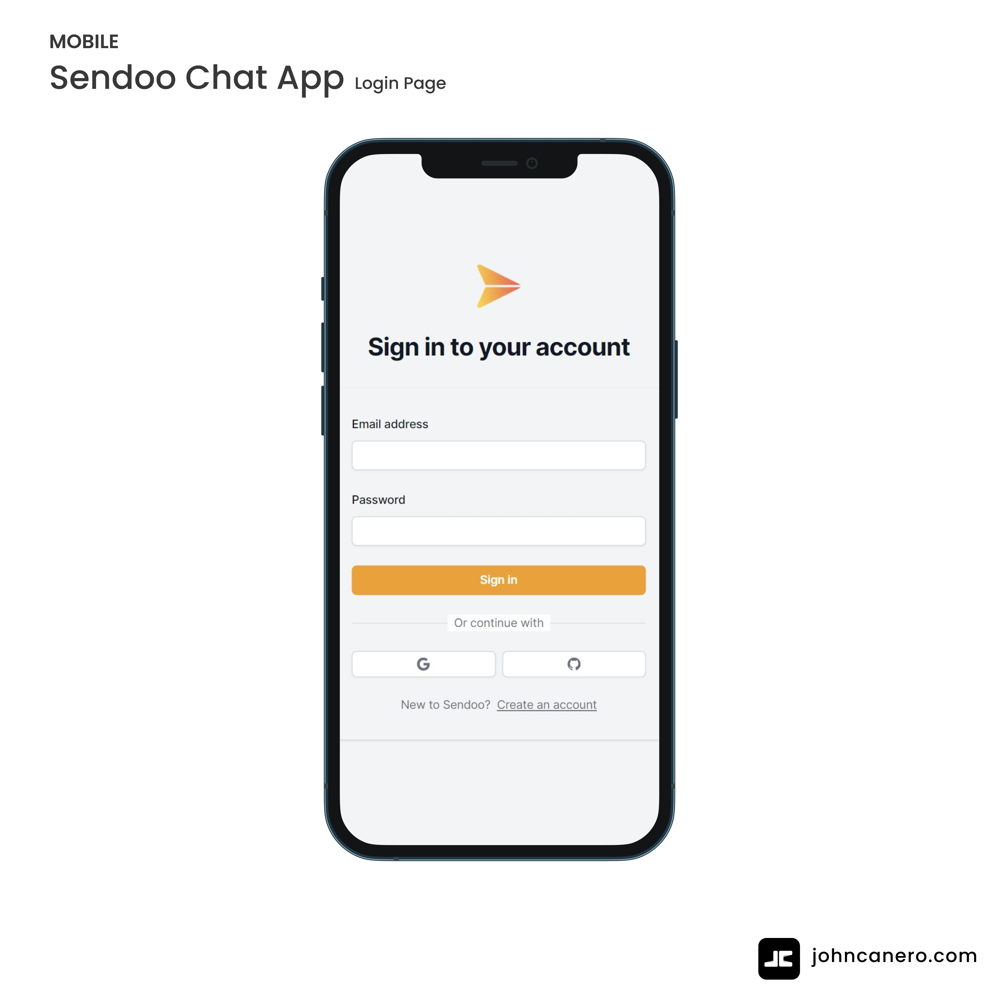

<!-- Installation: 
    1. npx create-next-app@latest --typescript --tailwind 
        project name | EsLint = Yes | 'src/' directory = No | experiemntal app directory = Yes
    2. View the layout.tsx and page.tsx 
    3. Modify ico.co (flaticon) 
    4. Create a seperate folder (site) for page.tsx and run npm run dev

    5. Create a components folder with AuthForm.tsx
    6. install npm install react-cons react-hook-form clsx
-->

<!-- markdownlint-configure-file {
  "MD013": {
    "code_blocks": false,
    "tables": false
  },
  "MD033": false,
  "MD041": false
} -->

  

# Sendoo Chat App

Sendoo Chat App, real-time messaging using Next.js, React, & Pusher: enabling seamless instant communication between users.

• Real-time messaging with Next.js, React, and Pusher: Sendoo Chat App delivers instant and responsive communication, enabling seamless conversations between users.

• Secure user authentication with MongoDB, NextAuth, and Prisma: Users can effortlessly log in and log out, with their credentials securely managed, ensuring a convenient and safe experience. ⚪🔵

#sendoo #chat #app #messenger #nextjs #reactjs #pusher #communicaion

## Website

🖥️ [https://sendoo-chat-app.vercel.app/"]

## Responsive Design

🪟: [Desktop - Tablet - Mobile]

<!-- Login -->

<!-- User -->

